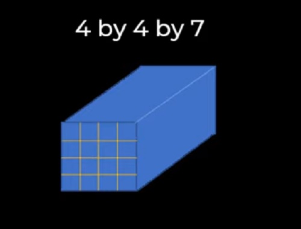
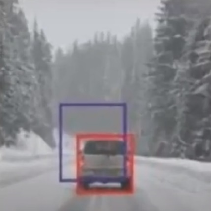

# YOLO real time object detection

## Content:

* Demo
* YOLO definition
* Other algorithms before YOLO
* YOLO features
* How YOLO Works

## Demo:
Video link : <a href="https://www.youtube.com/watch?v=bJ8WOxt_NEo&t=1s" target="_blank">youtube video</a>

## YOLO definition:
YOLO stands for you only look once it is a state of the art object detection algorithm that detects and recognizes various objects and locating them using a bounding box.

## Other algorithms before YOLO:
1- Sliding window object detection
2- R CNN
3- Fast R CNN
4- Faster R CNN

## YOLO features:
1- YOLO algorithm knon by it's high speed of detection.
2- YOLO algoritnm is high accuracy with more than 95%.
3- YOLO algorithm learning capabilities.

## How YOLO works?
1- The image is divided into cells then in each cell the model will explore to detect objects as regular image processing.

2- Locating the object by a bounding box using the below matrix
[Pc
 bx
 by
 bh
 bw
 c1
 ..
 cn]
where:
Pc is the probability if the object exist.
bx, by : determine the center of the bounding box.
bh, bw : hight and width of the bounding box.
c1..cn: the classes of my object.
this is done with each cell, resulting with matrix of 3 dimensions while width and height of natrix are the number of cells in image and depth of matrix are the first 5 values plus number of classes. for example if image divided to 4 by 4 and 2 classes the matrix will look as below

3- Intersection over union (IOU): 
Decide the most accurate predicted bounding box that we calculate the intersection between the real box and the predicted box over the union of both boxes and this give us value between 0 and 1 as shown in below image, which mean more accuracy when value became near to 1 as 0.8 and 0.9.

4- Non max supression:
In this step we remove all bounding boxes with the least accuracy value for same object and choose only one bounding box with highest accuracy using IOU from the previous step.

